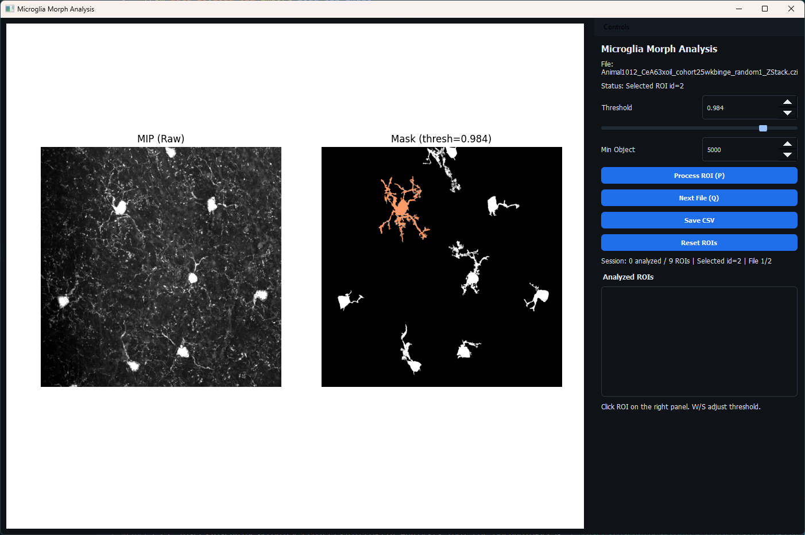
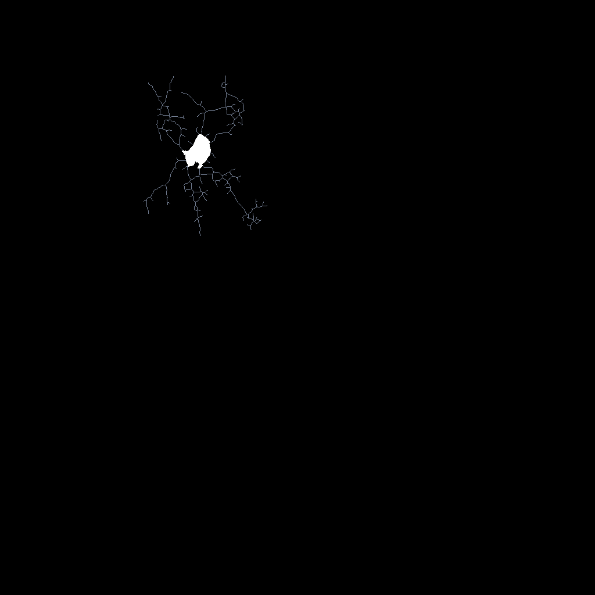
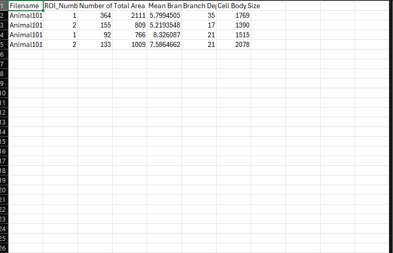

# Microglia Analysis Tool for Morphology

Improved GUI tool for microglia morphology analysis on CZI image stacks. This project provides a fast, interactive workflow for thresholding, ROI selection, skeleton export, and per-ROI statistics.

## Status
Active development. Current focus is on GUI usability and reproducible analysis workflows. Validation figures and case-study results will be added.

## Overview
This application loads CZI stacks, computes a maximum intensity projection (MIP) for visualization, allows threshold-based segmentation, and supports ROI-by-ROI processing with saved skeletons and quantitative metrics.

## GUI Preview


## Key Features
- GUI for CZI stack inspection and threshold tuning
- ROI selection with keyboard navigation (A/D)
- Per-ROI skeleton export and quantitative metrics
- Session panel with analyzed ROI list
- Configurable visualization controls

## Project Structure
- `app.py`: Main entry point (GUI).
- `ui/qt_view.py`: Qt GUI and interaction logic.
- `data_io/`: CZI loading utilities.
- `processing/`: Core processing algorithms (znorm, morphology, skeletonization).
- `ROI_Save/`: Output directory for skeletons and CSV stats.

## Installation
1. Create and activate a virtual environment.
2. Install dependencies:
   ```bash
   pip install -r requirements.txt
   ```

## Running the App
From the project root:
```bash
python app.py
```

## Controls
- `W` / `S`: Increase / decrease threshold
- `A` / `D`: Previous / next ROI
- `P`: Process selected ROI
- `Q`: Next file (auto-saves CSV and exits at end)
- `V`: Toggle mask visibility

## Outputs
- Skeletons: `ROI_Save/Morph_Skeletons/<czi_stem>/ROI_<n>.tiff`
- Stats CSV: `ROI_Save/Processed Stats/ROI_Stats_<folder>.csv`

## Configuration (Quick)
Edit the `Quick Config` block at the top of `app.py` to adjust visualization settings, especially the left-panel colormap:
- `raw_cmap = "gray"` or `"plasma"`

## Data Requirements
- Input data should be `.czi` files located in the configured `file_path` directory.

## Planned Validation
Future validation will include case-study comparisons of microglia morphology across conditions such as:
- Alcohol-exposed vs control mouse brain sections
- Early-stage vs late-stage Alzheimer's models

## Examples



## License
TBD.

## Acknowledgments
Built for microglia morphology analysis workflows using Python, Qt, NumPy, scikit-image, and Matplotlib.
